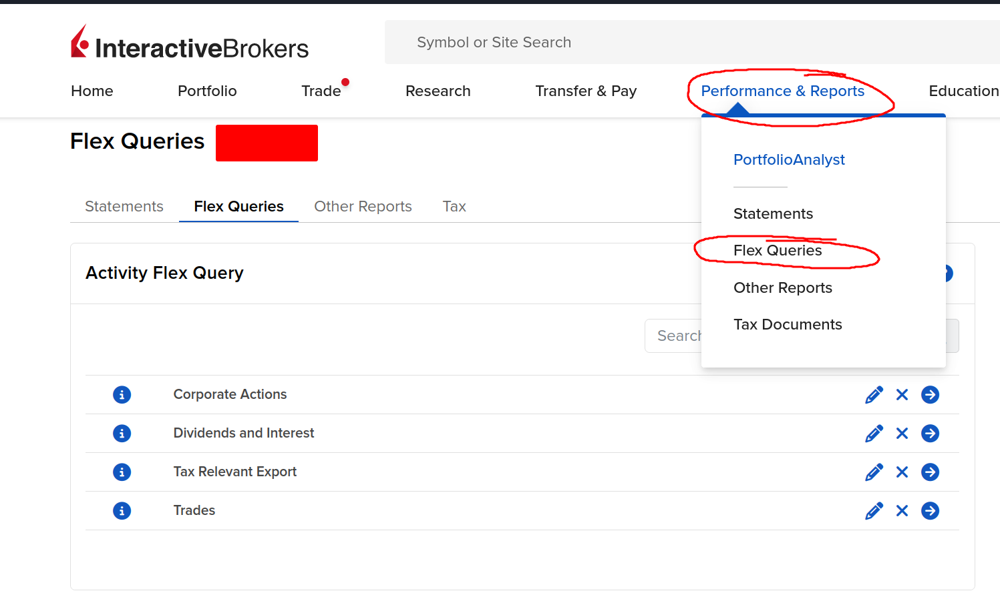
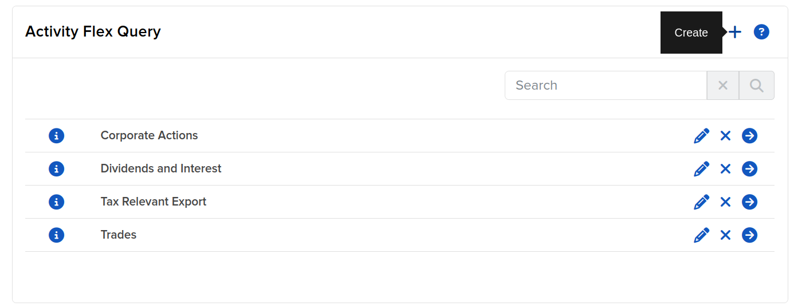
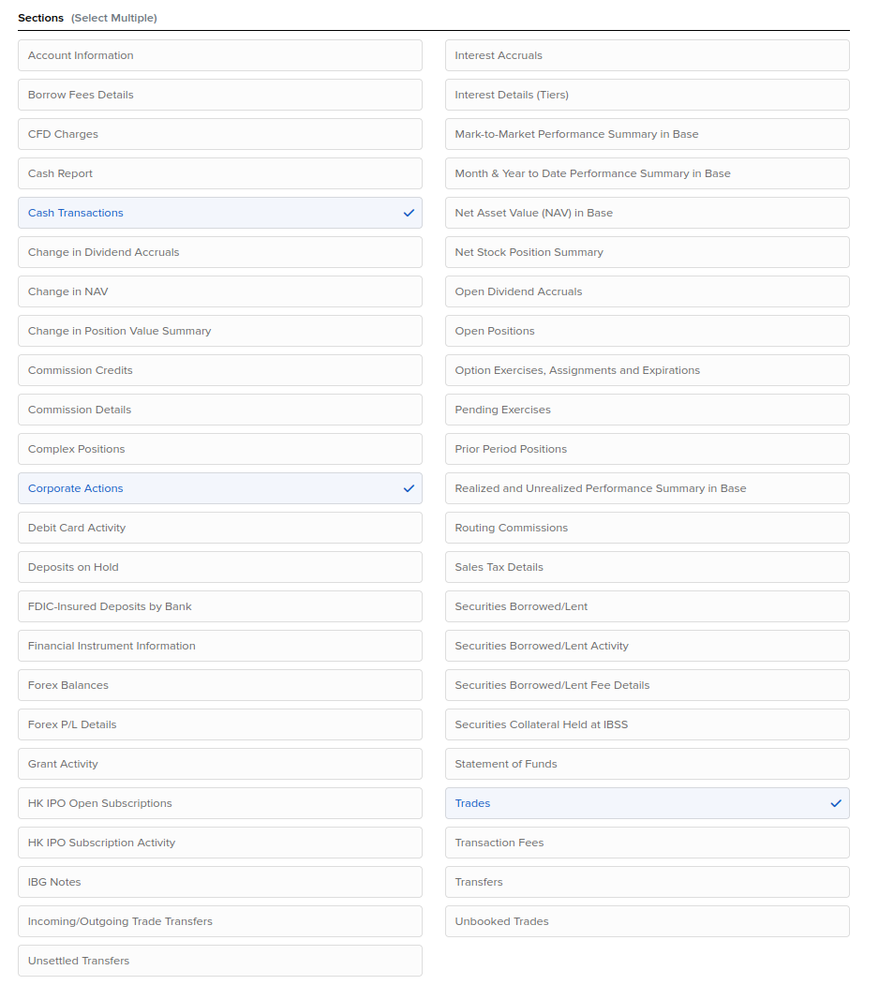
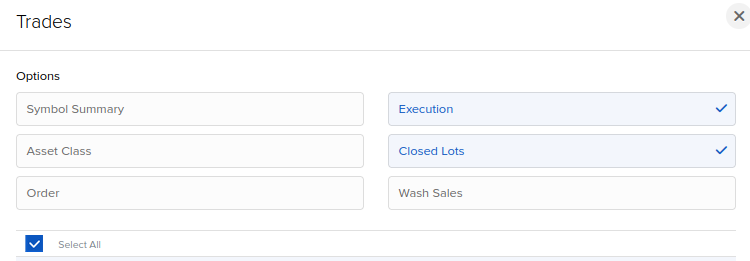
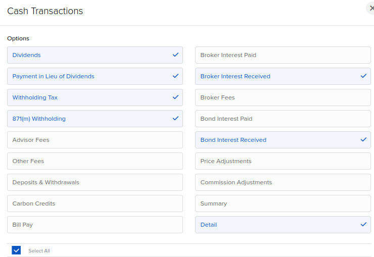

# Generate import forms for The Tax Man

> Generated exports can be wrong, so verify the generated reports before submitting to your tax authority.

## How To Use
### Generate Broker Export

#### Section Field Selections
> All sections should select all available fields

### Run this program

