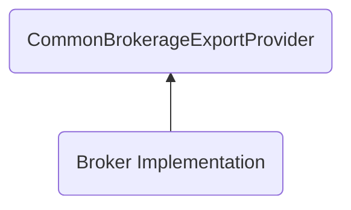
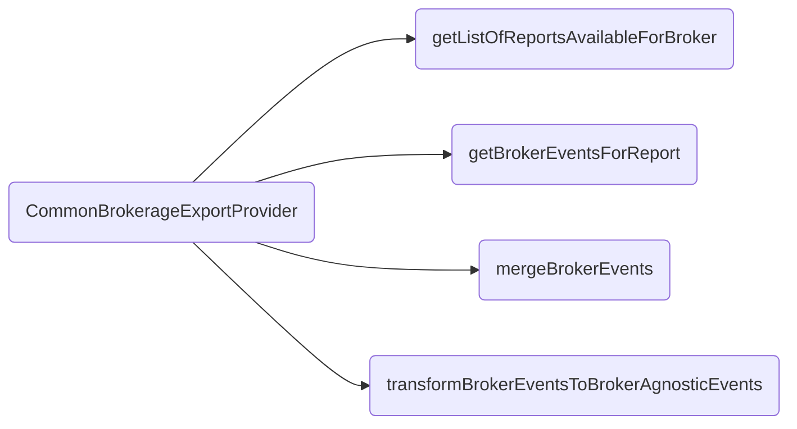

# How to develop new brokerage report importers

Brokerages are defined in [the following folder folder](/src/BrokerageExportProviders/Brokerages/). Each brokerage should be self-contained in a folder, and not leak any of its details to the rest of the system.

## Implementation

Each brokerage is a class that implements the `CommonBrokerageExportProvider` abstract class.

`CommonBrokerageExportProvider` requires implementation of 4 methods.

The following are simple goals each of these methods is supposed to achieve:
- getListOfReportsAvailableForBroker
    - Given a folder, return a list of files that this provider can process
- getBrokerEventsForReport
    - Given one of the files found through the above method, convert the said file into an instance of a `CommonBrokerageEvents` compatible type
- mergeBrokerEvents
    - Given multiple `CommonBrokerageEvents`, merge them into a single `CommonBrokerageEvents`
- transformBrokerEventsToBrokerAgnosticEvents
    - This transforms a single `CommonBrokerageEvents` into a staging type `StagingFinancialGrouping`

## Tips for implementing
### Define report schema
Define a schema for the entire report the broker generates. This will give you autocomplete in IDEs, while also making the code less bug prone.
### Create separate Extract and Transform scripts
Separate Extracting (of `CommonBrokerageEvents`) and their Transforming (to `StagingFinancialGrouping`) into their own files. This will make it easier to tell what's happening where.
### Create a module if you're injecting dependencies
Create a module for your the broker if there's a lot of dependency injection going on.
### Write tests
Makes tests for the broker and test out implementation of the `CommonBrokerageExportProvider` abstract class.
At minimum, write tests specifically for the Extract and Transform logics of the broker.