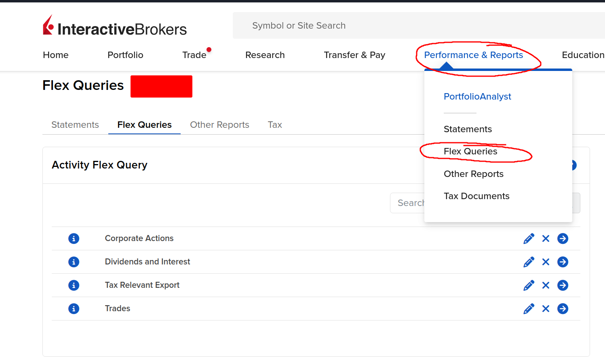
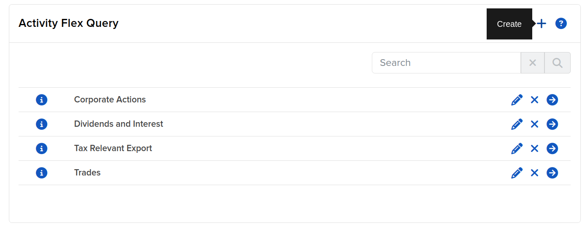
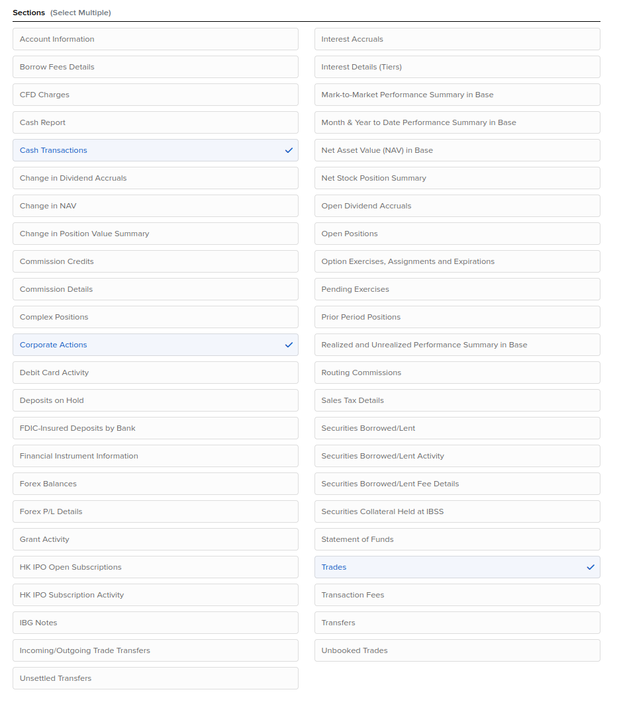
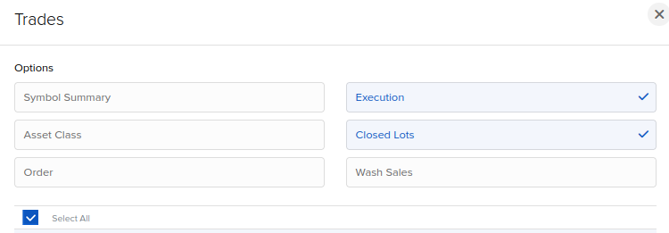
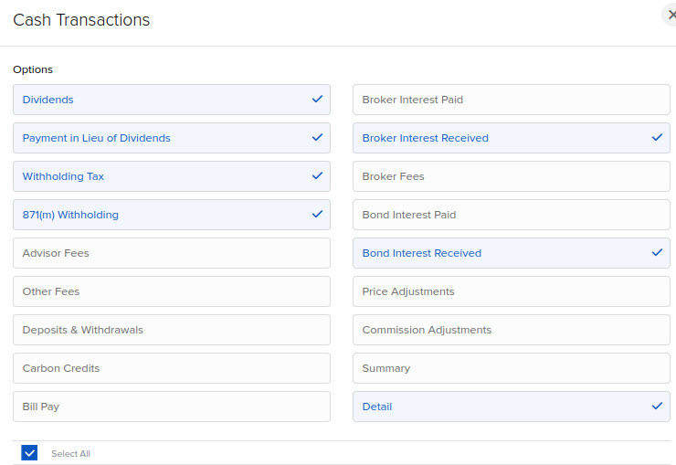

# Generate import forms for The Tax Man

**Generated exports can be wrong, so verify the generated reports before submitting to your tax authority.**

## How To Use
### Generate Broker Export

#### Section Field Selections
> All sections should select all available fields

### Run this program

1. Create a config file based on the example config in ./config directory
2. Place the Broker export inside the exports folder in ./exports directory
3. Run all cells in corresponding .ipynb file (make sure to fix dates to the year you're making a report for)

