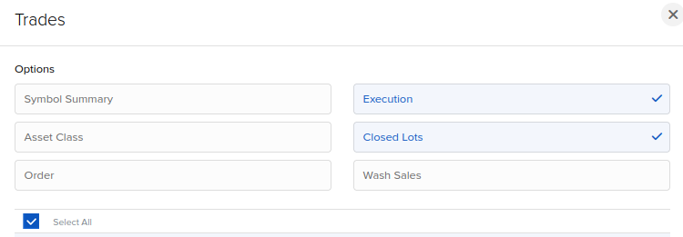

# Ustvarjanje uvoznih datotek za platformo EDavki

**Ustvarjeni izvozi lahko vsebujejo napake, zato se naj te preverijo za morebitne napake pred oddajo na platformi EDavki**

## Uporaba
### Generiranje Izvoza iz IBKR platforme

#### Izbiranje podrobnosti Flex Query Sekcij
> Izbrane sekcije naj vsebujejo vse podrobnosti

### Zagon Programa

1. Ustvari konfiguracijsko datoteko v ./config mapi (primer je podan)
2. Ustvarjen izvoz iz brokerja postavi v ./exports mapo
3. Zaženi vse celice v dividents.ipynb (popravi datume za leto katero hočeš imet generiran izvoz)

